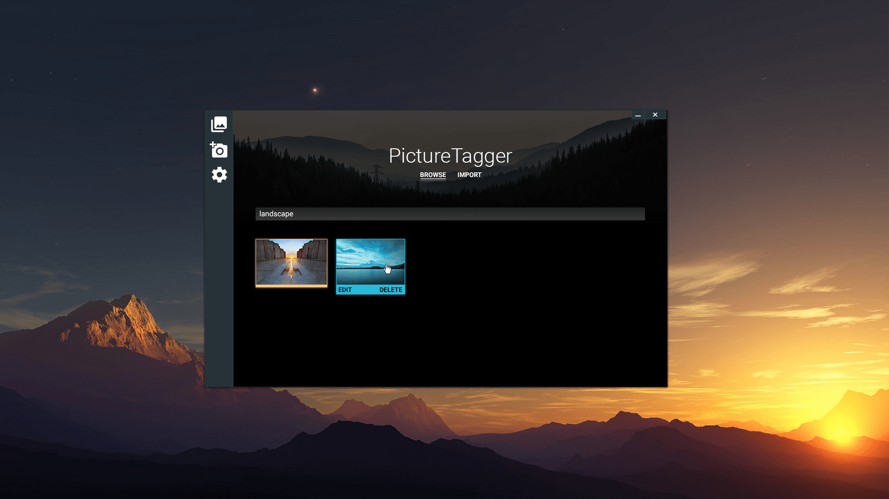

# PictureTagger

*`!finalnamehere`* will be the solution for users with large and expanding image libraries who need a level of organization currently unavailable. Our program will maintain a database of a user's local images (file paths) sorted with criteria that is meaningful to them rather than their filesystem. 
Users will add images or directories to the client which will gather default image metadata and enable a user to add additional attributes to define an image like *"tags"*. These attributes can be updated at any time with respect to each image, and will make image searches significantly more efficient.

## Former concept

Before *The John'd Incident* on March the 29th, 2016, PictureTagger was destined to look like this.

